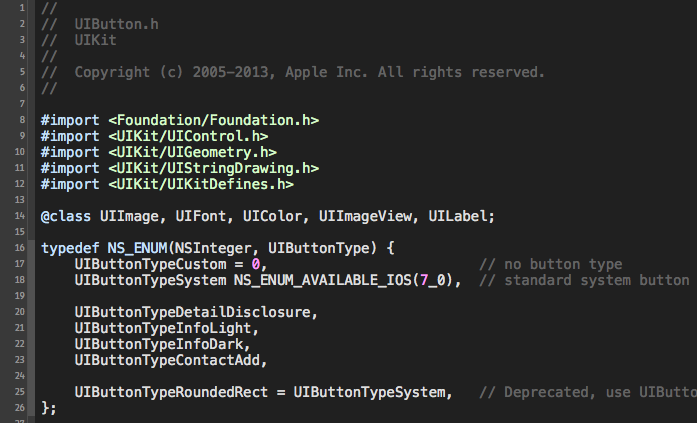
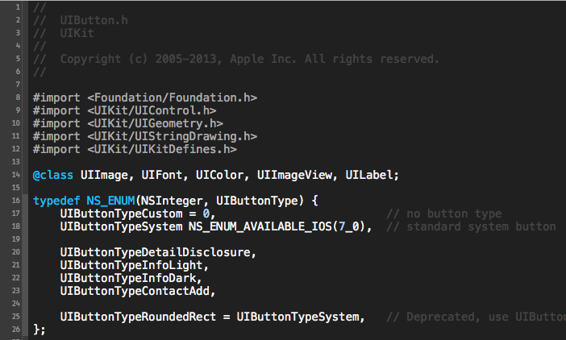

Themes for Xcode
===========
## Index

* **DAS** - this is a theme based on Gary Bernhardt's terminal used in [Destory All Software Screencasts](http://destroyallsoftware.com) 

* **Sphinx** - White / Grey / Blue theme based off of [https://github.com/chroman-forks/omgthemes/blob/master/Sphinx.dvtcolortheme](https://github.com/chroman-forks/omgthemes/blob/master/Sphinx.dvtcolortheme)

## Installation

1. Copy the theme(s) to the Xcode's ``FontAndColorThemes`` folder (``~/Library/Developer/Xcode/UserData/FontAndColorThemes/``).
2. Restart Xcode.
3. Enjoy.
