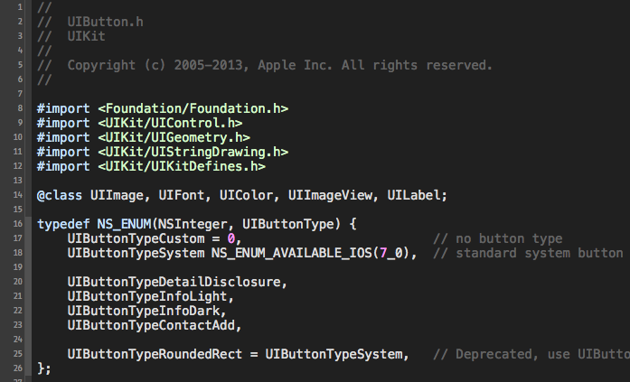

Themes for Xcode
===========
## Index

* **DAS** - this is a theme based on Gary Bernhardt's terminal he uses in [Destory All Software Screencasts](http://destroyallsoftware.com) 

## Installation

1. Copy the theme(s) to the Xcode's ``FontAndColorThemes`` folder (``~/Library/Developer/Xcode/UserData/FontAndColorThemes/``).
2. Restart Xcode.
3. Enjoy.